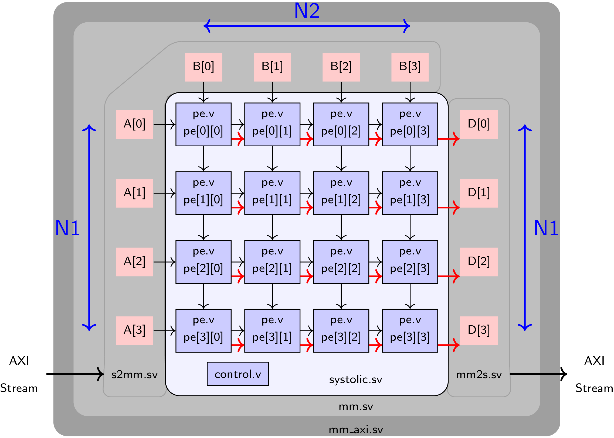

# Matrix Multiplication with a Systolic Array Design on a hybrid SoC  

In this project, I have implemented a matrix multiplication kernel in a systolic array design, capable of handling memory and AXI-Streaming protocol for I/O and handshaking on the Xilinx PYNQ FPGA+ARM SoC.

## Design Description:

The components for the complete systolic design are shown below.

### Systolic and Processing Element Implementation

#### `pe.v`

1. `clk` : 1 bit input : This is the clock input to the module
2. `rst` : 1 bit input : This is a synchronous reset signal
3. `init` : 1 bit input : This is the init signal that flushes the accumulator
4. `in_a` : D_W bits input : This is the first PE operand.
5. `in_b` : D_W bits input : This is the second PE operand.
6. `out_a` : D_W bits output : This is the output that streams out registered in_a
7. `out_b` : D_W bits output : This is the output that streams out registered in_b
8. `in_data` : D_W_ACC bits input : This is the input stream of `D` matrix data 
9. `in_valid` : 1 bit input : Valid signal for `in_data`
10. `out_data` : D_W_ACC output : This is the output stream of `D` matrix data 
11. `out_valid` : 1 bit output : Valid signal for `out_data`

#### `systolic.sv` 

1. `clk` : 1 bit input : This is the clock input to the module
2. `rst` : 1 bit input : This is a synchronous reset signal
3. `enable_row_count_A` : 1 bit input : Enable counter operation for the cascaded counter (row counter of `A`).
4. `A` : D_W bits x N1 bits input : `A`'s data lane to feed into systolic array
5. `B` : D_W bits x N2 bits input : `B`'s data lane to feed into systolic array
6. `pixel_cntr_A` : $clog2(M) bits output : Column pointer generated by counter associated with `A` matrix
7. `slice_cntr_A` : $clog2(M/N1) bits output : Row pointer generated by counter associated with `A` matrix
8. `pixel_cntr_B` : $clog2(M/N2) bits output : Column pointer generated by counter associated with `B` matrix
9. `slice_cntr_B` : $clog2(M) bits output : Column pointer generated by counter associated with `B` matrix
10. `D` : D_W_ACC bits x N1 bits output: Data us for `D`. Each channel connected to a separate systolic lane.
11. `valid_D` : N1 bits output : Valid bus for `D`. Each channel connected to a separate systolic lane.

## Limitation:

This design was tested on the Xilinx PYNQ Board for M=20 N=20 at f=105MHz, where M is the size of the input array and N is the size of the systolic processing square matrix.